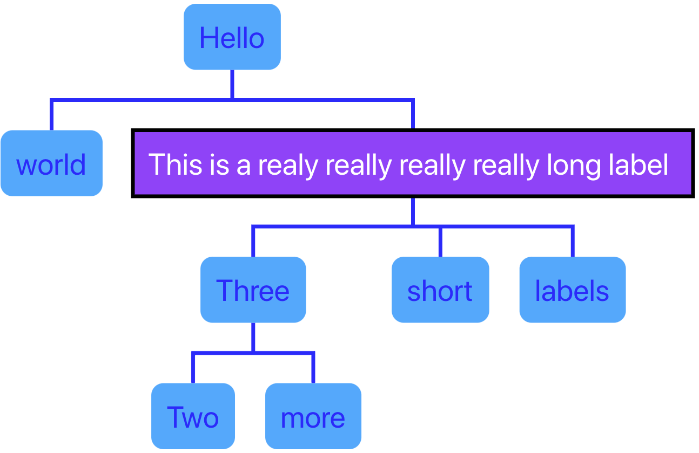

# A Tiny Tree Hierarchy Graph

This is minimal tree hierarchy with no dependencies (other than react) that is just 3kb minified.  

* Nodes are represented using SVG text and rect elements
* Connectors are represented using SVG paths
* Styling can be applied to the graph overall or at the individual node level
* Supports typescript!

## Usage

```tsx
import React from 'react';
import BoxTree { tree, SimpleBoxProps } from "react-heirarchy-tree-graph2"

const DarkBlue = "#3f0fff"
const LightBlue = "#61a5ff"
const LightPurple = "#923afc"

const data: tree<SimpleBoxProps> = {
  data: { label: "Hello" },
  children: [
    { data: { label: "world" } },
    {
      data: {
        label: "This is a realy really really really long label",
        // Props to be applied to this particular element's <rect/>:
        rect_props: { fill: LightPurple, rx: "0px", stroke: "black", strokeWidth: "2px" },
        // Props to be applied to this particular element's <text/>:
        text_props: { fill: "white" }
      },
      children: [
        {
          data: { label: "Three" },
          children: [
            { data: { label: "Two" } },
            { data: { label: "more" } }
          ]
        },
        { data: { label: "short" } },
        {
          data: { label: "labels" }
        }
      ]
    }]
}

function App() {
  return (
      <BoxTree
        // data to be graphed
        data={data}
        // padding within the boxes in rem
        padding={.5}
        // margin around the boxes in rem
        margin={1}
        // extra space around the graph in px (* see below)
        border={2}
        // Props passed to the connector SVG `<path>` elements
        path_props={{ stroke: DarkBlue }}
        // Props passed to the background SVG `<rect/>` elements (unless overridden in the data)
        rect_props={{ fill: LightBlue, rx: ".4rem" }}
        // Props passed to the SVG `<text/>` elements (unless overridden in the data)
        text_props={{ fill: DarkBlue }}
      />
  );
}

export default App;
```

_*_ About the border property: The rendered element is a react `<svg>`
element whose size is *exactly* the width and height of the of the tree
**excluding any borders applied to the nodes**. When the border property is
supplied, the overall size of the rendered `<svg>` element is increased by
the border amount (in px) in order to prevent the outside borders of the
background `<rect>`s from being cut off

Result:


